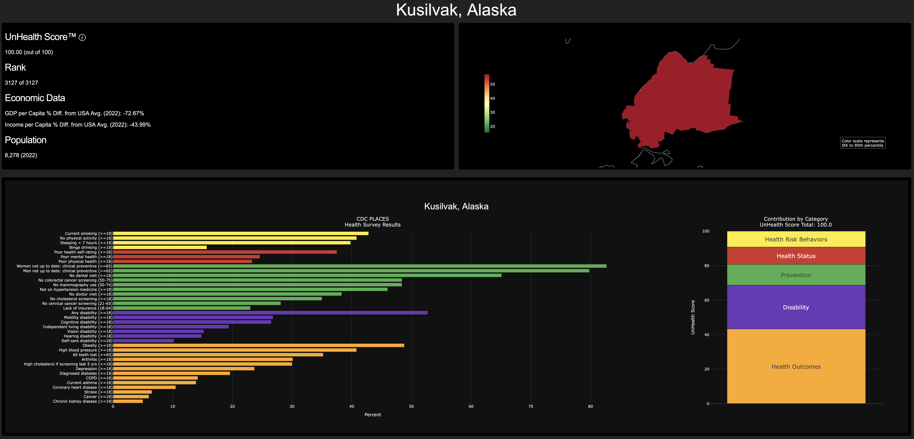
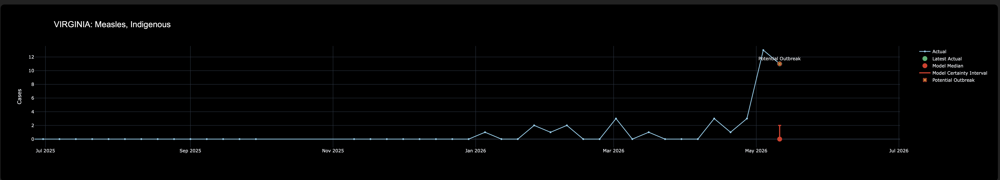
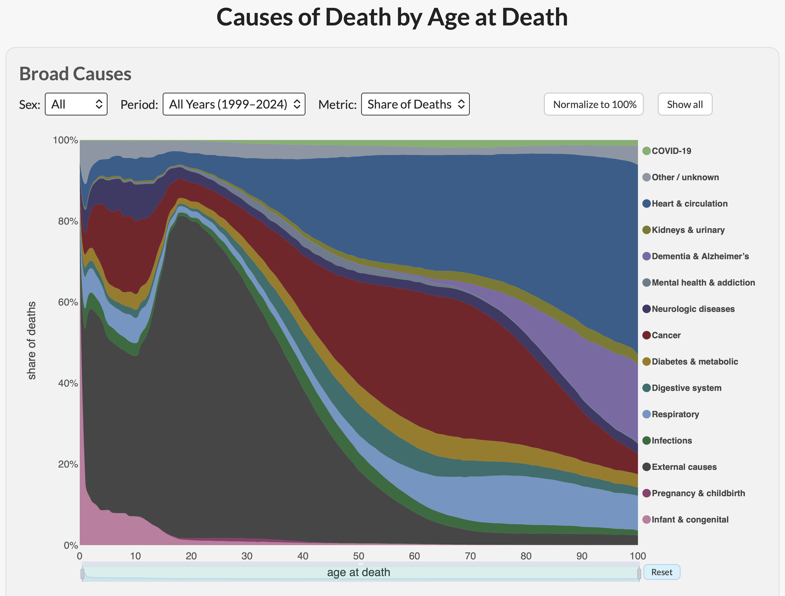
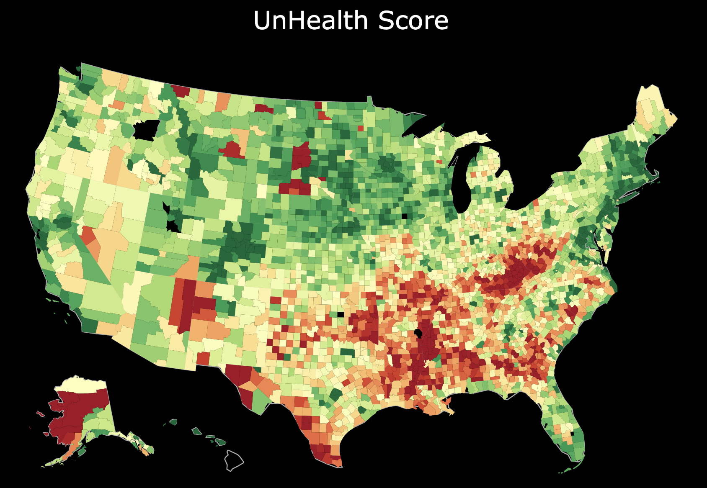

# John Slough II

Data scientist and statistician focused on health data, public-health analytics, forecasting, reproducible analysis, and interactive data products.

I build practical statistical and machine-learning tools for messy real-world data: disease surveillance dashboards, public-health visualizations, forecasting systems, and decision-support tools.

Most of my work sits at the intersection of applied statistics and data science, with an emphasis on making complex results clear enough for people to understand and act on.

  

## Example Projects

### OUTBREAK

Automated public-health surveillance dashboard for identifying potential outbreaks of nationally notifiable diseases in the United States.

- CDC NNDSS data
- DeepAR time-series forecasting and outbreak thresholding
- Automated dashboard built with Plotly Dash and AWS

[Live dashboard](https://outbreak-tracker.com/)
[GitHub repo](https://github.com/SloughJE/OUTBREAK)

  

### How We Die

Interactive mortality explorer showing how causes of death in the United States vary by age, sex, and time period.

* CDC/NCHS mortality data
* ICD-10 cause-of-death groupings
* Mortality rates, yearly deaths, and share of deaths

[Project page](https://sloughje.github.io/how-we-die/)

  

### The UnHealth Dashboard

County-level public-health dashboard combining health, economic, and synthetic patient data.
A core component of the dashboard is the UnHealth Score™. This score aggregates various health indicators, 
facilitating direct county comparisons and highlighting areas needing health interventions.

- CDC PLACES data
- County-level health comparisons
- BEA and BLS economic indicators

[Live app](https://unhealth-dashboard-6d75504325c4.herokuapp.com/)
[GitHub repo](https://github.com/SloughJE/unhealth_dashboard)

  

## Background

My path into data science started with wanting to understand the statistics behind health and nutrition research: how studies were designed, how results were analyzed, and how conclusions were justified.

That interest eventually led me to a Master’s in Statistics, after completing an MBA and an MSc in ICT Business Management. 

I have over 10 years of experience in applied data science and statistics through consulting and direct roles across many industries, including public health, healthcare, cybersecurity, aerospace, hospitality, utilities, manufacturing, and government (USDA, NASA, FAA).
One aviation and air-traffic management project involved machine-learning modeling for aircraft landing-time prediction. I contributed to the modeling work and co-authored a related paper with NASA researchers and collaborators: [A Machine Learning Approach to Predict Aircraft Landing Times using Mediated Predictions from Existing Systems](https://ntrs.nasa.gov/api/citations/20210017594/downloads/20210017594_Wesely_Aviation2021_paper.pdf).

I currently run JS Data Science Services, where I help organizations turn complex data into useful models, dashboards, reports, and analytical tools.

I’m interested in projects where the hard part is not just fitting a model, but asking the right question, understanding the data, making assumptions explicit, and communicating results clearly.

I especially enjoy the stage of analysis where results are communicated: turning analytical findings into clear charts, dashboards, and explanations that people who are not statisticians or data scientists can understand and use.

[Website](https://www.jsdatascience.com/)
[LinkedIn](https://www.linkedin.com/in/johneslough/)
[GitHub](https://github.com/SloughJE)
